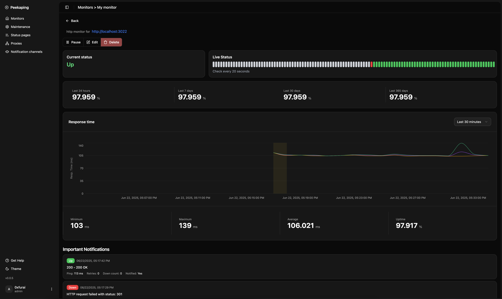

# Peekaping 🚀


**A modern, self-hosted uptime monitoring solution**

Peekaping is a powerful, feature-rich uptime monitoring system similar to Uptime Kuma, built with Go and React. Monitor your websites, APIs, and services with real-time notifications, beautiful status pages, and comprehensive analytics.

##  Live Demo

Want to see Peekaping in action? Try our live demo:

🔗 **[https://demo.peekaping.com](https://demo.peekaping.com)**

The demo allows you to explore all features instantly in your browser without any setup. Perfect for evaluating Peekaping before deploying your own instance!

## 📚 Documentation

For detailed setup instructions, configuration options, and guides:

🔗 **[Docs](https://docs.peekaping.com)**

## ⚠️ Beta Status

**Peekaping is currently in beta and actively being developed.** While I am excited to share this project with the community, please note that:

- The software is still undergoing testing and refinement
- Some features may be incomplete or subject to change
- I recommend testing in non-production environments first
- Please report any issues you encounter - your feedback helps us improve!

We encourage you to try Peekaping and provide feedback, but please use it at your own discretion. Your testing and feedback are invaluable to making Peekaping production-ready! 🚀

## 💡 Motivation

Peekaping is designed as a modern alternative to Uptime Kuma, built with a focus on **strongly typed architecture** and **extensibility**. Our server is written in Go, a fast and efficient language that enables a small footprint while maintaining high performance. The codebase is structured for easy extensibility, allowing developers to seamlessly add new notification channels, monitor types, and even swap out the database layer without major refactoring.

The client-side application is also strongly typed and built with modern React patterns, making it equally extensible and maintainable. This combination of type safety, performance, and modular design makes Peekaping an ideal choice for teams who need a reliable, customizable uptime monitoring solution.



## 📡 Stay in the Loop

I share quick tips, dev-logs, and behind-the-scenes updates on&nbsp;Twitter.
If you enjoy this project, come say hi &amp; follow along!

[](https://x.com/0xfurai)

## ✨ Features

### 🔍 **Monitoring Types**
- **HTTP/HTTPS Monitoring** - Monitor websites, APIs, and web services with comprehensive options
- **TCP Port Monitoring** - Monitor TCP port connectivity and availability
- **Ping Monitoring (ICMP)** - Traditional ping monitoring using ICMP packets
- **DNS Monitoring** - Monitor DNS query responses and resolution times
- **Push Monitoring** - Monitor services that push heartbeats to a generated URL endpoint
- **Docker Container Monitoring** - Monitor Docker container status and health

### 📊 **Real-time Dashboard**
- Live status updates with WebSocket connections
- Interactive charts and statistics
- 24-hour uptime tracking
- Response time monitoring (ping)
- Visual heartbeat history

### 🔔 **Smart Notifications**
- **Multiple Channels**: Email (SMTP), Slack, Telegram, Webhooks
- **Intelligent Alerting**: Configurable retry logic before marking as down
- **Notification Control**: Set resend intervals to avoid spam
- **Important Events**: Only get notified when status actually changes

### 📄 **Status Pages**
- **Public Status Pages** - Share service status with your users

### 🛠 **Advanced Features**
- **Maintenance Windows** - Schedule maintenance to prevent false alerts
- **Proxy Support** - Route monitoring through HTTP proxies
- **2FA User Authentication** - Secure login with 2FA support
- **Real-time Collaboration** - Multiple users can monitor simultaneously
- **Data Retention** - Automatic cleanup of old heartbeat data

### 🏗 **Technical Highlights**
- **Modern Stack**: Go backend, React frontend, MongoDB database
- **Cloud Native**: Docker support with docker-compose
- **API First**: Complete REST API with Swagger documentation
- **Real-time**: WebSocket connections for live updates
- **Scalable**: Architecture with dependency injection

## 🚀 Quick Start

### Prerequisites
- Docker and Docker Compose
<!-- - Node.js 18+ and pnpm (for development)
- Go 1.24+ (for development) -->

#### Mongodb
```bash
# 1. Grab defaults
curl -L https://raw.githubusercontent.com/0xfurai/peekaping/main/.env.prod.example -o .env
curl -L https://raw.githubusercontent.com/0xfurai/peekaping/main/nginx.conf -o nginx.conf
curl -L https://raw.githubusercontent.com/0xfurai/peekaping/main/docker-compose.prod.mongo.yml -o docker-compose.yml

# 2. Fire it up
docker compose up -d

# 3. Visit the UI
open http://localhost:8383
```

#### Postgres
```bash
# 1. Grab defaults
curl -L https://raw.githubusercontent.com/0xfurai/peekaping/main/.env.prod.example -o .env
curl -L https://raw.githubusercontent.com/0xfurai/peekaping/main/nginx.conf -o nginx.conf
curl -L https://raw.githubusercontent.com/0xfurai/peekaping/main/docker-compose.prod.postgres.yml -o docker-compose.yml

# 2. Fire it up
docker compose up -d

# 3. Visit the UI
open http://localhost:8383
```

#### SQLite
```bash
# 1. Grab defaults
curl -L https://raw.githubusercontent.com/0xfurai/peekaping/main/.env.prod.example -o .env
curl -L https://raw.githubusercontent.com/0xfurai/peekaping/main/nginx.conf -o nginx.conf
curl -L https://raw.githubusercontent.com/0xfurai/peekaping/main/docker-compose.prod.sqlite.yml -o docker-compose.yml

# 2. Fire it up
docker compose up -d

# 3. Visit the UI
open http://localhost:8383
```

## 🐳 Docker

### Official Images
- **Server**: [`0xfurai/peekaping-server`](https://hub.docker.com/r/0xfurai/peekaping-server) - Go backend API
- **Web**: [`0xfurai/peekaping-web`](https://hub.docker.com/r/0xfurai/peekaping-web) - React frontend
- **Migrator** [`0xfurai/peekaping-migration`](https://hub.docker.com/r/0xfurai/peekaping-migration) - SQL db schema migration

# Docker Compose Files

### docker-compose.dev.{db}.yml
These files are for local testing and build the entire stack locally from Dockerfiles

### docker-compose.prod.{db}.yml
These files are production-ready configurations that pull pre-built containers from Docker Hub

### docker-compose.{db}.yml
These files run standalone databases for local development, designed to work with `turbo run dev`

## 🛠 Development Setup

### Full Stack Development
**Create environment file in root:**
```bash
cp .env.example .env
# Edit .env with your configuration

# Install all dependencies
pnpm install

# run turbo
turbo run dev docs:watch
```


## ⚙️ Configuration

### Environment Variables

```env
DB_USER=root
DB_PASSWORD=your-secure-password
DB_NAME=peekaping # file path for sqlite like /app/data/peekaping.db)
DB_HOST=localhost
DB_PORT=6001
DB_TYPE=mongo # postges | mysql |sqlite

PORT=8034
CLIENT_URL="http://localhost:5173"
ACCESS_TOKEN_EXPIRED_IN=1m
ACCESS_TOKEN_SECRET_KEY=secret-key
REFRESH_TOKEN_EXPIRED_IN=60m
REFRESH_TOKEN_SECRET_KEY=secret-key
MODE=prod # logging
TZ="America/New_York"
```

## 🔒 Security

### Authentication
- JWT-based authentication
- Optional 2FA with TOTP
- Secure session management

### Best Practices
- Use strong passwords and JWT secrets
- Regular security updates
- Secure your db instance
- Use HTTPS in production

### Reverse Proxy Setup

Example Nginx configuration included in `nginx.conf`.

## 🤝 Contributing

We welcome contributions! Please:

1. Fork the repository
2. Create a feature branch
3. Make your changes
4. Add tests if applicable
5. Submit a pull request


## 📝 License

This project is licensed under the MIT License - see the [LICENSE](LICENSE) file for details.

## 🙏 Acknowledgments

- Inspired by [Uptime Kuma](https://github.com/louislam/uptime-kuma)
- Built with amazing open-source technologies
- Thanks to all contributors and users

## 📞 Support

- **Issues**: Report bugs and request features via GitHub Issues
---

**Made with ❤️ by the Peekaping team**
